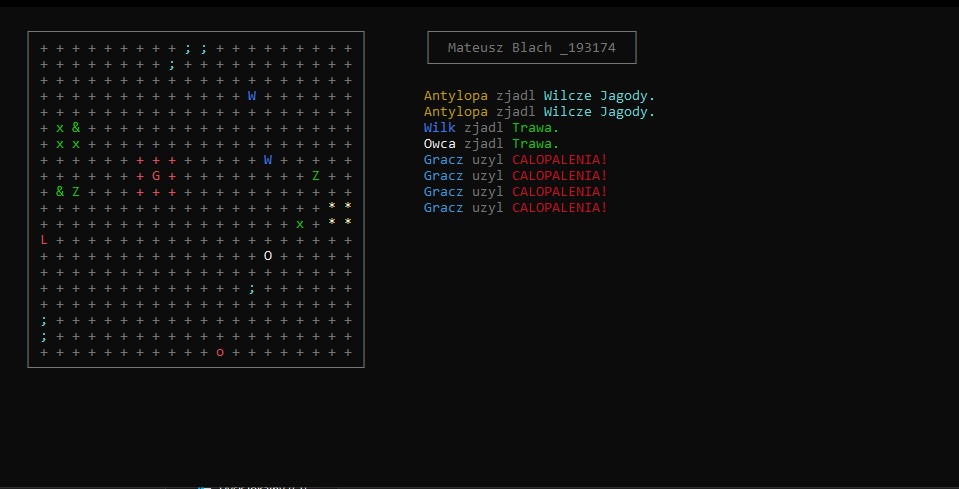

# 🌎 Life Simulator

> Simple Life Simulator console-base game written in **C++** 

---

## 🎮 Gameplay Preview

> _Below: screenshot from the game_

---

## 🔎 Features

- ⚙️ **Random spawn**: random creatures and plants spawn on the map, creating a dynamic and unpredictable environment.
- 🎮 **Turn-based actions**: with each player move, all creatures and plants on the map perform a unique action.
- 🔥 **Special ability**: the player can ignite creatures and plants around him for few moves.
- 📜 **Game event log**: Track every action that happens during the game with an event log

---

## 🎮 Controls

| Key              | Action      |
|------------------|-------------|
| ⬅️ A             | Move Left   |
| ➡️ D             | Move Right  |
| ⬆️ W             | Move Up     |
| ⬇️ S             | Move Down   |
| 🔥 F             | Ability     |
| 💾 O             | Save game   |
| 🔄 L             | Load game   |

---
